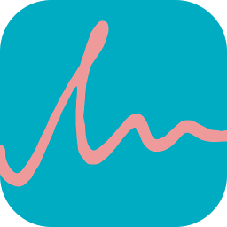
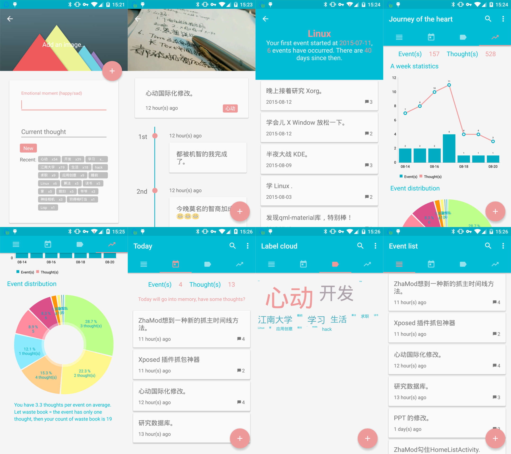

#心动 HeartBeat



心动——记录生活中的心动瞬间。

HeartBeat - Record your emotional moments.

##截图 ScreenShots



##下载 Download

<a href="https://play.google.com/store/apps/details?id=com.maxiee.heartbeat"></a>

[酷市场下载地址 CoolMarket download](http://coolapk.com/apk/com.maxiee.heartbeat)

##应用说明

心动是一款生活日记工具，您可以用它记录生活中的心动瞬间，添加感想。回忆这些瞬间，感悟生活，添加新的感想，面对真实的自我，更好地面对未来。

你可以把它当做是心灵的日记本，心灵的随笔录，甚至是心灵的照相机。

记录下生活中的每一个心动瞬间，添加您的感悟。

除此之外，您还可以使用标签对事件分类，从而更好地梳理生活。标签还具有纪念日功能，统计您对生活做出的努力。

您也可以为事件添加照片，留下美好回忆。

为了帮助您更好地提高生活质量，心动设立了心路功能，能够帮您从对所有事件进行统计，从而掌握自己的心态变化。

心动特色功能：

1. 事件列表：浏览生活中的大小事。

2. 今日：浏览当日事件，发表感想，记录新事件。

3. 事件详情：独特的时间轴效果，串起你的思绪。

4. 标签：给事件可添加多个标签，按标签分类浏览事件，方便你更好地组织心动事件。

5. 标签云：生活重心在哪里，在标签云中一览便知。

6. 纪念日：点击标签，即可浏览此标签下的事件，以及起始信息。

7. 心路：对事件以及感想进行统计，反映近来状态变化以及自身心态。

8. 搜索：搜索记录下的事件。

9. 手势密码：添加手势密码，防止他人看到您的隐私。

10. 备份功能：将数据备份至外部储存或云服务。并可以导入恢复。

心动为一款开源 APP， GitHub 项目主页：https://github.com/maxiee/HeartBeat

为了保护您的隐私，心动不使用网络访问权限，没有联网操作，您可以放心地记录自己的生活。

##Introduction

HeartBeat is a life journal APP. You can record your emotional moment and add thoughts with it. Though recalling the moments, you can add new thoughts. By facing the true self, you may In the face of the future better.

You can view HeartBeat as a diary of your mind, a journal of your heart, and even an camera of your spirit.

Record every emotional moment in your life, add your thoughts.

Beyond that. you can add labels to events in order to classify them. There is also a memorial day in the label detail page.

You can add an image to every event, to leave a good memory.

To help you improve your quality of life, HeartBeat designs a function called Journey of the heart. It shows a statistics by analyzing your events and thoughts, to help you understand your mind-changing.

Features:

1. Event list: Look through your events.

2. Today: View your events today, add new event.

3. Event Detail: Contains a wonderful time axis, organizing your thoughts.

4. Label: Each event can add several labels. Through classifying events by labels, you can organize your life better.

5. Label cloud: Help you find life center.

6. Memorial day: Click a label, shows the memorial day information and the relative events under this label.

7. Journey of the heart: It shows a statistics by analyzing your events and thoughts, to help you understand your mind-changing.

8. Search: search your events.

9. Guesture password: Protect from others seeing your privacy by adding a guesture password.

10. Back up: Back up your data to external storage or cloud services and restore by import it.

HeartBeat is an open source APP, GitHub homepage:  https://github.com/maxiee/HeartBeat

In order to protect your privacy, HeartBeat doesn't use Internet access permission. There is no network connection. You can safely record your life.

##License

```
Copyright (c) 2015 Maxiee

Licensed under the Apache License, Version 2.0 (the "License”);
you may not use this file except in compliance with the License.
You may obtain a copy of the License at
   
   http://www.apache.org/licenses/LICENSE-2.0

Unless required by applicable law or agreed to in writing, software
distributed under the License is distributed on an "AS IS" BASIS,
WITHOUT WARRANTIES OR CONDITIONS OF ANY KIND, either express or implied.
See the License for the specific language governing permissions and
limitations under the License.
```

##联系方式 Contact Me

新浪微博 Sina Weibo：[@Maxiee_Bayesian](http://weibo.com/maxiee)

邮箱 Email：maxieewong@gmail.com

##关于我 About me

[我的简历 resume in Chinese](http://maxiee.github.io/static/html/resume.html)，欢迎与我联系！